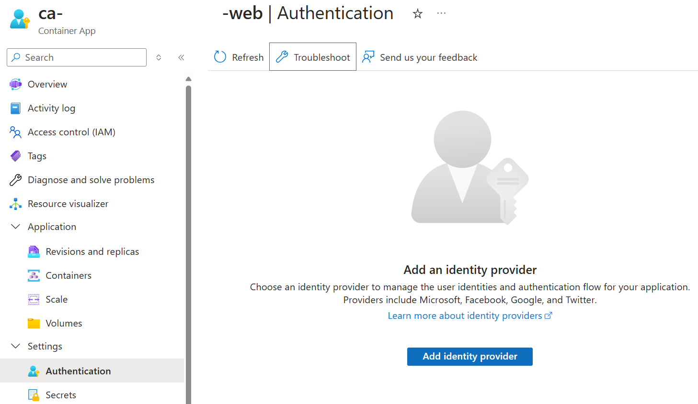
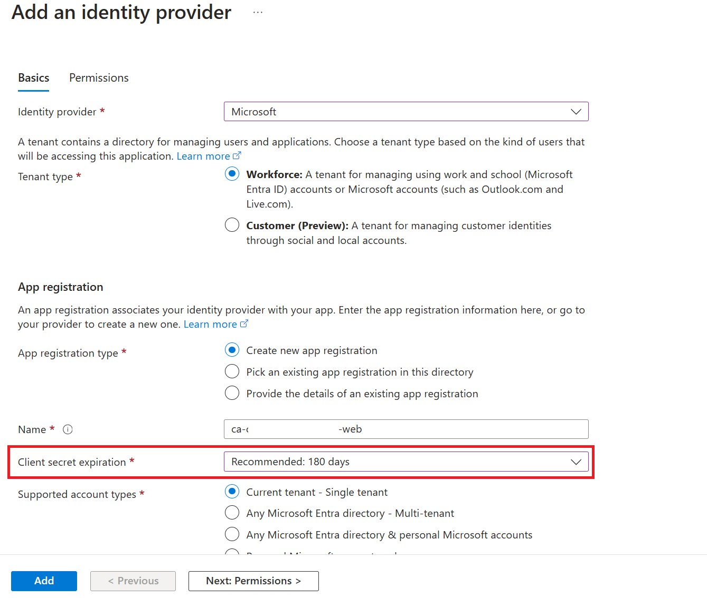
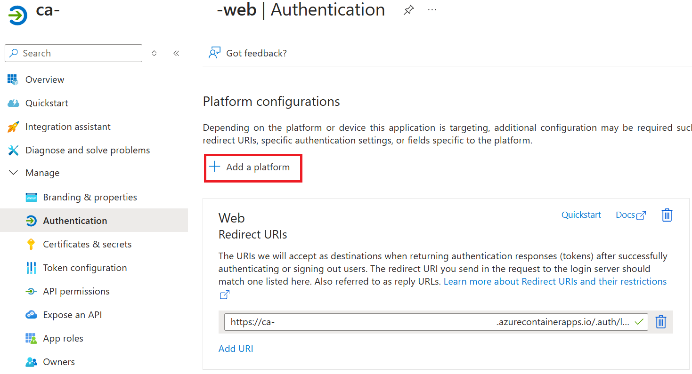
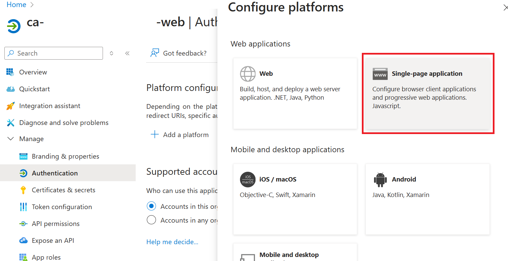
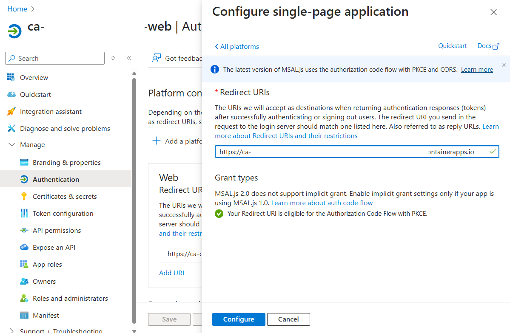
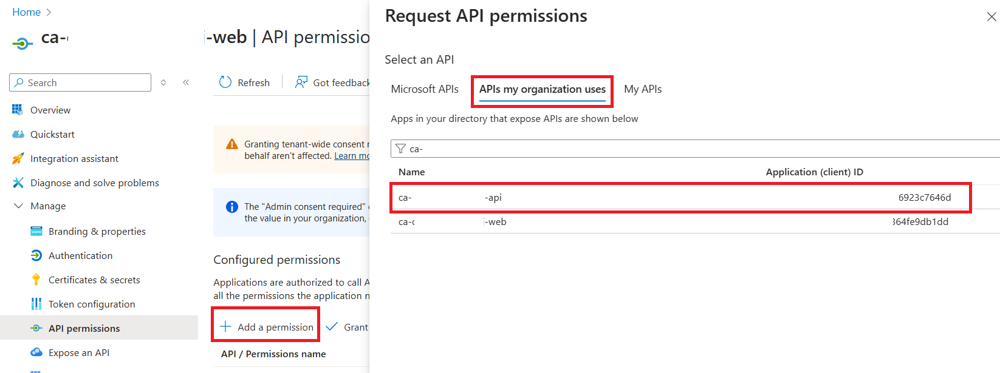

# Set up Authentication in Azure Container App

This document provides step-by-step instructions to configure Azure App Registrations for a front-end and back-end application.

## Prerequisites
- Access to **Azure Active Directory (Azure AD)**
- Necessary permissions to create and manage **App Registrations**

## Step 1: Add Authentication Provider  
We will add Microsoft Entra ID as an authentication provider to API and Web Application. 

1. Add Authentication Provider in Web Application  
 
   - Go to deployed Container App and select ca-< your environment >-< randomname >-web and click **Add Identity Provider** button in Authentication  

   - Select **Microsoft** and set **Client secret expiration** then Click **Add** button  

2. Add Authentication Provider in API Service  
 
    - Go to deployed Container App and select **ca-< your environment >-< randomname >-api** and click **Add Identity Provider** button in Authentication  

    - Select **Microsoft** and set **Client secret expiration**  
  

    - Set **Unauthenticated requests** then Click **Add** button  

## Step 2: Configure Application Registration - Web Application
1. Set Redirect URI in Single Page Application Platform
    - Go to deployed Container App **ca-< your environment >-< randomname >-web** and select **Authentication** menu then select created Application Registration  
  

    - Select **Authentication** then Select **+ Add a platform** menu  
  

    - Select **Single-page application**  

    - Add Container App **ca-< your environment >-< randomname >-web**'s URL  
   
   -  You may get this URL from here in your Container App

2. Add Permission and Grant Permission  
     - Add Permission for API application. Select **+ Add a permission** button then search API application with name **ca-< your environment name >-<unique string>-api**  

      - Grant admin consent to permissions  

## Step 3: Configure Application Registration - API Application  
Add Web Application Registration's Client Id to API's Allowed client application list.

## Step 4: Update Environment Variable in Container App for Web Application
Update Environment variable for Client Id in Web App's application registration, Scope for Web as auth scope, Scope for API as token scope

## Conclusion
You have successfully configured the front-end and back-end Azure App Registrations with proper API permissions and security settings.